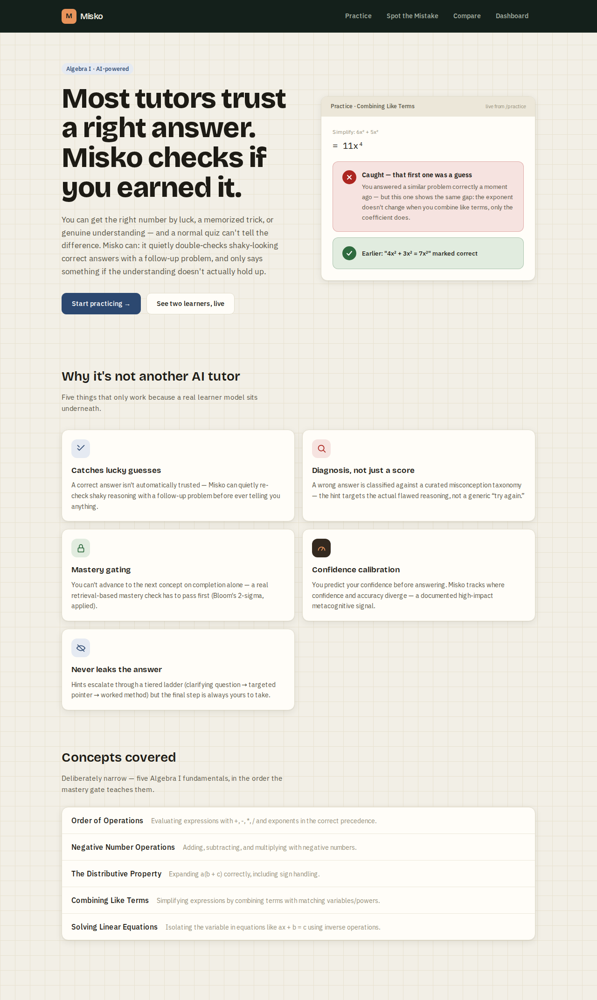
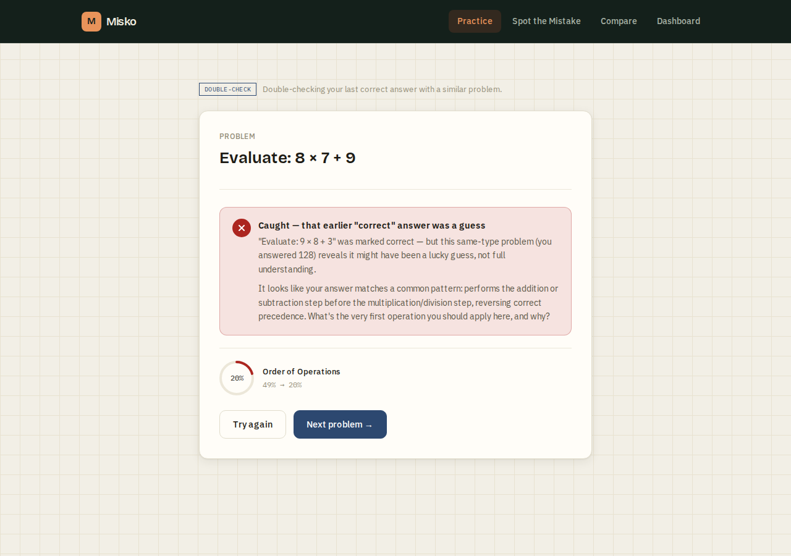
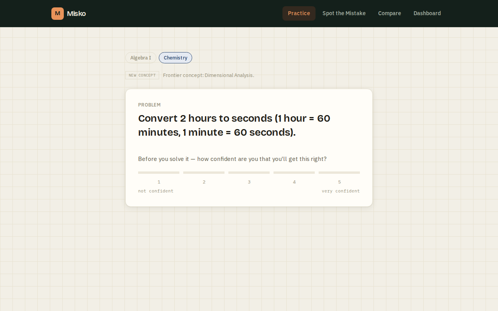
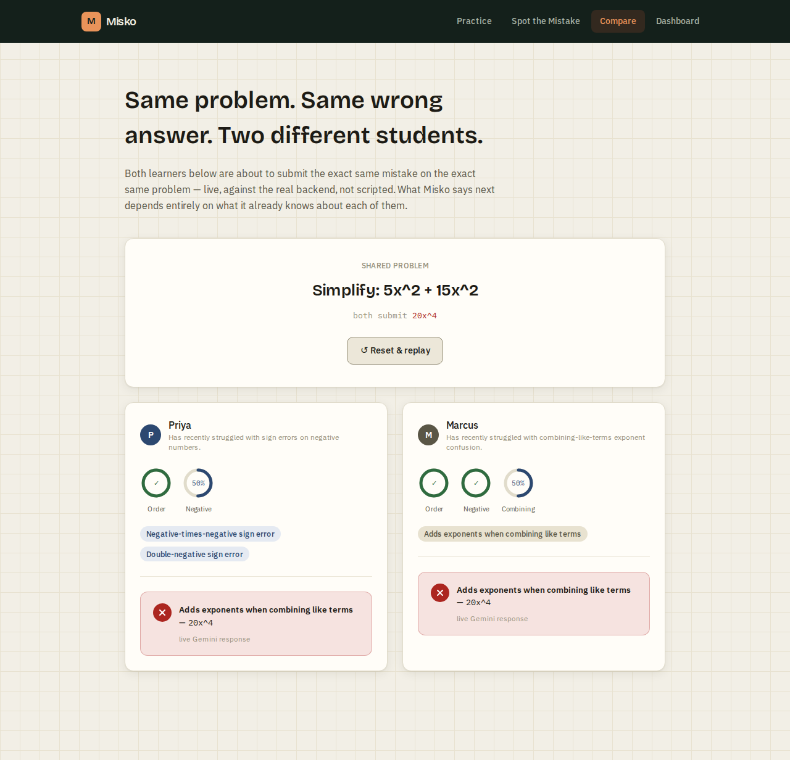
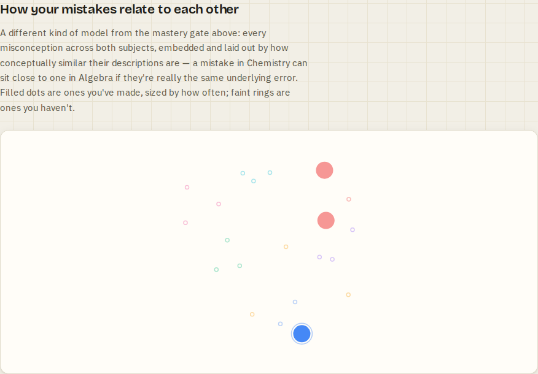

# Misko

Most AI tutors just check if your answer is right. Misko checks whether you actually
understood the problem or got lucky.

Built for the [Prom Virgo Challenge](https://virgo.devpost.com), an AI/ML education
hackathon.

Live demo: https://misko-theta.vercel.app

Note on the live demo: it's a UI preview, not the full app. It has no Gemini API key
set, so all hints/diagnoses come from the fallback templates instead of live AI text.
It also runs on Vercel's serverless functions, and the app's JSON-file storage needs one
persistent process to work, so nothing you do actually gets saved there — mastery
tracking, misconception history, and the confirmation mechanic below won't do anything
on this deployment. Run it locally (see Setup) for the real thing.



## The problem

You can get a math problem right by luck, a half-remembered trick, or actually
understanding it, and a normal quiz can't tell those apart. Most AI tutors (Khanmigo,
Quizlet's Q-Chat, plain ChatGPT wrappers) only check if the final answer is correct —
if it is, they move on. Recent research calls this the "Correct Answer Trap": even
sophisticated AI tutors miss flawed reasoning hiding behind a right number.

## What it does



- **Catches lucky guesses.** If a correct answer's reasoning looks shaky, Misko quietly
  gives you a follow-up problem of the same type. Get it wrong too, and it tells you the
  first one might not have been solid. Get it right, and nothing is said — it never
  accuses you off a single guess, only after a second, independently-graded problem
  confirms it. The dashboard tracks this as a headline stat: N/M answers confirmed
  solid.
- **Diagnoses the specific misconception** behind a wrong answer (e.g. "you applied
  left-to-right evaluation instead of operator precedence"), not just that it's wrong —
  matched against a curated taxonomy of named misconceptions.
- **Works across subjects, not just Algebra I.** A subject switcher on `/practice`
  moves between Algebra I (15 misconceptions across 5 concepts) and chemistry
  (dimensional analysis and mole ratios, 6 more misconceptions across 2 concepts) in
  the same session — same diagnosis pipeline, same mastery gate, same AI layer, no
  code path forked for the second subject. Algebra I was the proof-of-concept domain,
  not the ceiling of what the architecture underneath it can cover.

  
- **Never gives away the answer.** Wrong answers get a Socratic hint (three escalating
  levels) aimed at the specific misconception, not the solution.
- **Gates progress on actual mastery**, not just completing problems. Each concept's
  mastery is a live probability estimate (Bayesian Knowledge Tracing, updated after
  every answer) rather than a plain streak counter, so one slip during review lowers it
  instead of wiping out your progress. You watch this number update right after you
  answer, not just on the dashboard later.
- **Tracks confidence calibration.** You predict your confidence before answering, and
  the dashboard shows where that diverges from your actual accuracy.
- **Adapts problem difficulty to your actual mastery**, not a fixed level forever. The
  same misconception gets easier numbers early on and meaningfully bigger ones as your
  mastery estimate for that concept climbs — a concept you've already mastered gets
  its hardest numbers once it comes back for spaced review, so "mastered" actually
  gets tested under harder conditions, not just re-served the same easy problems.
- **Notices if you're rushing.** If your wrong answers are consistently coming in much
  faster than your correct ones, the dashboard says so directly.
- **Classifies freeform reasoning.** If your wrong answer doesn't match a known
  mistake pattern, you can write out how you solved it and Gemini classifies the
  misconception from your explanation instead of just the final number. You can also
  speak it (browser speech-to-text), upload a photo of handwritten work, or hold it up
  to your webcam live — Gemini reads it and transcribes it into the same text field.
  Reading an image needs a live API key (no fallback is possible for that); everything
  else works either way.
- **Streams the diagnosis as it's written**, not as a static block that appears all at
  once — same as watching a real response come in, not a canned popup.
- **Shows the correct derivation visually**, not just in words — a number line, balance
  scale, or annotated expression, computed straight from the same verified numbers as
  the answer itself, never generated by a model.
- **A downloadable report card.** A shareable image built from your real progress —
  concepts mastered, misconceptions resolved, confirmed-vs-caught — not a screenshot,
  an actual PNG you can keep.
- **`/compare` proves the personalization is real.** It seeds two learners with
  different histories, has both submit the same wrong answer to the same problem
  through the real backend, and shows their diagnoses come out different.

  
- **`/spot-the-mistake` flips the exercise around.** Instead of solving a problem,
  you're shown a step-by-step solution that gets it wrong on purpose (using the same
  misconception taxonomy) and have to find which step is the error — learning to
  recognize a specific mistake pattern, not just avoid making it yourself. How many
  you've caught is tracked and shown on the dashboard, separate from concept mastery.
- **Mastered concepts come back for review**, spaced by how many problems you've
  answered since, not calendar days — get one right, the gap before the next check
  grows; miss one, it comes back soon. Same idea as spaced-repetition apps, just paced
  by activity instead of a clock, so it actually shows up in one sitting instead of
  needing you to come back tomorrow.
- **Acts on your confidence calibration, not just charts it.** If you're consistently
  confident but wrong, or consistently unsure but right, the dashboard says so directly
  instead of leaving you to notice the pattern in a bar chart yourself.
- **Export and restore your progress.** There are no accounts here on purpose, which
  means clearing your browser or switching devices normally loses everything with no
  way back. `/dashboard` lets you download a backup and restore it later, or in a
  different browser.

## Who it's for

High school / early college students. Two subjects right now — Algebra I
fundamentals (order of operations, negative numbers, the distributive property,
combining like terms, solving linear equations) and introductory chemistry
(dimensional analysis, mole ratios/stoichiometry) — switchable mid-session on
`/practice`. Narrow on purpose within each subject rather than trying to cover
everything.

## How AI is used

Problem generation and answer-checking are plain deterministic code — every problem has
a known-correct answer and a known set of wrong answers mapped to specific
misconceptions (`src/lib/domain/problemEngine.ts`, `src/lib/analyzer.ts`). Gemini is
only used for the parts that need actual language understanding: turning a diagnosed
misconception into a natural hint, classifying freeform written reasoning, reading
handwritten work from a photo, and raising a soft "this correct answer might be shaky"
hypothesis that's always double-checked with a real graded problem before anything is
shown to the learner. It never invents whether an answer is right.

A few more things in here are "ML" in a different sense than prompting an LLM. Mastery
estimation is Bayesian Knowledge Tracing (`src/lib/bkt.ts`, fixed literature-typical
parameters, no training data). When no Gemini key is configured at all, freeform
wrong-answer classification falls back to a local TF-IDF + cosine-similarity match
(`src/lib/domain/textSimilarity.ts`) instead of just giving up — a real, if weaker,
technique with no API call involved. It's tuned deliberately conservative: an early
threshold looked fine on easy cases but produced confidently wrong matches between
misconceptions that share vocabulary, so it now only fires on close-to-verbatim
phrasing. That tradeoff — and the test that caught it — is documented in the file.

And the misconception map on `/dashboard` is a genuinely different technique again:
every misconception's description is embedded once (`scripts/generateMisconceptionEmbeddings.ts`,
`npm run generate-embeddings`) and laid out in 2D by cosine similarity — precomputed
offline and committed as static data, not a live API call — so a learner can see their
own mistakes cluster by conceptual similarity, even across subjects. Four distinct
techniques doing real work here, not one LLM call wearing different labels: prompting,
BKT, TF-IDF, and embeddings + similarity layout.



## Tech

- Next.js 14 (App Router), TypeScript, Tailwind CSS — one app, API routes as the backend
- Google Gemini API (`gemini-flash-latest` by default)
- A plain JSON file as the datastore (`better-sqlite3`'s native binding kept segfaulting
  on this machine's Node 18, so this avoided that entirely)
- Bayesian Knowledge Tracing for mastery estimation (`src/lib/bkt.ts`) — fixed,
  literature-typical parameters, no training data involved
- A local TF-IDF + cosine-similarity classifier (`src/lib/domain/textSimilarity.ts`) as
  a no-API-key fallback for freeform misconception classification
- Text embeddings + a hand-rolled 2D similarity layout for the misconception map
  (`scripts/generateMisconceptionEmbeddings.ts`), precomputed and committed as static
  data — no live API call needed to view it
- Framer Motion and canvas-confetti for the parts of the UI where a value actually
  changes (mastery rings, the reasoning trace, `/compare`'s reveal, a mastery-crossing
  moment) — not swapped in for a UI kit, just motion around what's already there
- Zod for input validation on every API route
- Vitest, 336 tests covering the deterministic core, mastery gate,
  adaptive difficulty, spaced review, calibration, export/import, real HTTP route
  behavior (rate limiting, validation, error paths), AI fallback behavior, streaming,
  and input validation

## Setup

```bash
npm install
cp .env.example .env
# add your Gemini API key to .env (get one at https://aistudio.google.com/apikey)
# not required — the app works without one, just with template hints instead of Gemini
npm run dev
```

Visit `http://localhost:3000`.

### Tests

```bash
npm test
```

## Usage

1. Go to `/practice`. You'll get a problem for your current concept.
2. Predict your confidence (1-5), then answer.
3. Wrong answers get a diagnosis tied to the specific mistake, never the correct answer.
   You get an escalating hint each retry; after 3 attempts the answer is revealed.
4. Correct answers get positive feedback and move you on — next concept, a review of a
   weaker one, another shot at something you got wrong before, or (if you wrote out your
   reasoning and it looked off) a quiet follow-up problem to double-check it.
5. `/dashboard` shows your actual state: confirmed-vs-caught stat, mastery per concept,
   misconception history, confidence calibration (with a direct callout if it's
   consistently off), an embeddings-based map of how your mistakes relate to each other,
   a downloadable report card, and a backup/restore option.
6. `/spot-the-mistake` for the reverse exercise: instead of solving a problem, find the
   error in a step-by-step solution that gets it wrong on purpose.
7. `/compare` seeds two fictional learners with different histories and has both submit
   the exact same wrong answer, live, so you can see the diagnosis actually diverge.

## Limitations

- Freeform reasoning classification only kicks in if you write out your work and the
  answer didn't already match a known mistake pattern.
- The lucky-guess check also needs written reasoning to trigger from Gemini, though a
  separate rule-based trigger covers the common case (wrong answer immediately followed
  by a correct one on the same concept) without needing AI at all. Either way, the
  underlying detection technique is weak on its own (~70-84% recall per arXiv
  2606.23205, 2605.23925), which is why nothing is ever shown to the learner off a
  single AI judgment — it always needs a second, independently graded problem to
  confirm. That makes the catch rate conservative: it'll miss more shaky reasoning than
  it flags, which felt like the right tradeoff for something meant to teach, not accuse.
- The JSON-file store needs one long-running process. Works fine with `npm run dev` /
  `npm start`, does not work on serverless hosts like Vercel (see the live demo note
  above) — would need a real database there.
- 2 subjects, 7 concepts, 21 misconceptions total. Narrow scope within each subject
  on purpose, not full coverage of either.
- No real student usage data behind any of this yet.
- Restoring a backup on `/dashboard` replaces everything currently in this browser for
  the current learner id — it's a clean replace, not a merge, with a confirmation
  prompt since it can't be undone.
- Spot the Mistake tracks its own separate stat, deliberately not folded into concept
  mastery — diagnosing someone else's mistake and solving a problem yourself are
  different skills, and mixing the signals didn't seem justified.

## Structure

```
src/lib/domain/            concepts, misconceptions, problem engine, flawed worked examples
src/lib/analyzer.ts        answer classification
src/lib/bkt.ts             Bayesian Knowledge Tracing (mastery estimation)
src/lib/learnerModel.ts    mastery gate, spaced review, calibration, export/import,
                            misconception history
src/lib/domain/textSimilarity.ts  local TF-IDF fallback classifier
src/lib/ai/                Gemini integration + fallback templates
src/lib/store.ts           JSON-file persistence
src/app/                   Next.js pages + API routes
tests/                     Vitest suite
```
